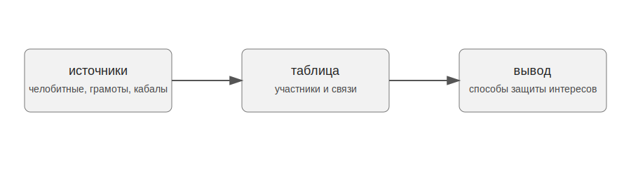

# Тема проекта

Проект посвящен судебным спорам, в которых участвовала община Устюга и Устюжского уезда в первой половине XVII века. В центре внимания находятся способы защиты коллективных интересов в делах, связанных с челобитными жителей Устюжской четверти.

Цель проекта состоит в том, чтобы показать, какие документы позволяют реконструировать судебные конфликты и какие практики защиты интересов общины в них проявляются.

{width=85% fig-align="center"}

# Источники

Основу проекта составляют актовые и делопроизводственные документы Устюжской четверти: челобитные, царские грамоты, памяти, поручные записи, заемные кабалы и отписи. Дополнительно используются сотная Устюга Великого 1630 года и крестоприводная книга Устюга Великого и Устюжского уезда 1645 года.

> Челобитная была письменным прошением или жалобой, с помощью которой частные лица или община обращались к власти.

Справочно о работе с историческими источниками можно обратиться к сайту [РГАДА](https://rgada.info/).

# Задачи

- описать основные группы источников;
- выделить участников судебных дел;
- показать связи между общиной, посредниками и приказной системой;
- представить результаты в виде простой таблицы и схемы.

# Порядок работы

1. Отбор дел, связанных с Саввой Ивановым сыном Пинегиным.
2. Выделение участников и типов документов.
3. Составление таблицы связей.
4. Подготовка простой визуализации.

# Пример таблицы

| Источник | Что фиксирует | Значение для проекта |
|---|---|---|
| Челобитная | жалобу или прошение | показывает позицию стороны |
| Поручная запись | поручительство | выявляет социальные связи |
| Заемная кабала | долг и условия займа | помогает понять причины спора |

# Пример обработки данных

```python
import pandas as pd

data = pd.DataFrame({
    "source": ["община", "Савва Пинегин", "Савва Пинегин"],
    "target": ["Савва Пинегин", "Устюжская четверть", "ответчики"],
    "relation": ["представительство", "челобитная", "судебный спор"]
})

data
```

# Визуализация

Ниже приведена простая схема связей между участниками дела.

<iframe src="visualization.html" width="100%" height="360" frameborder="0"></iframe>

# Предварительный вывод

Челобитные и связанные с ними документы позволяют рассматривать судебный спор как систему отношений между общиной, ее представителями, ответчиками и приказной властью. Такой подход помогает описать не только ход отдельных дел, но и способы защиты интересов общины.
